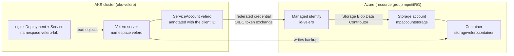
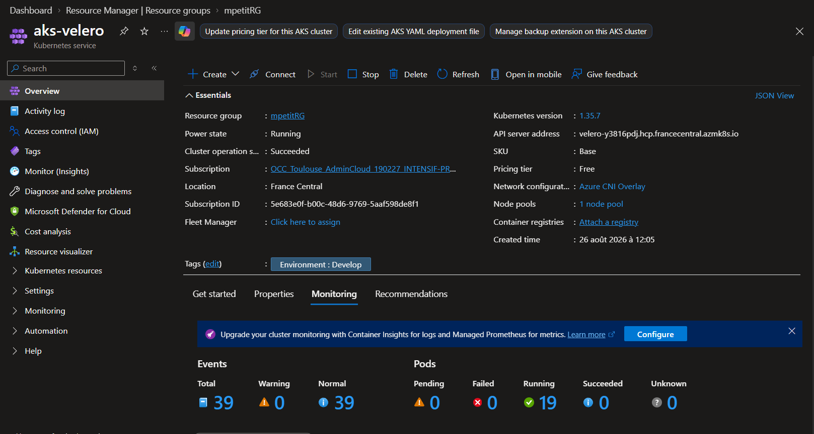
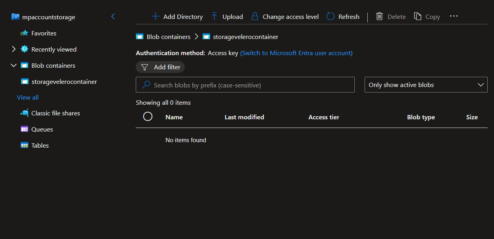
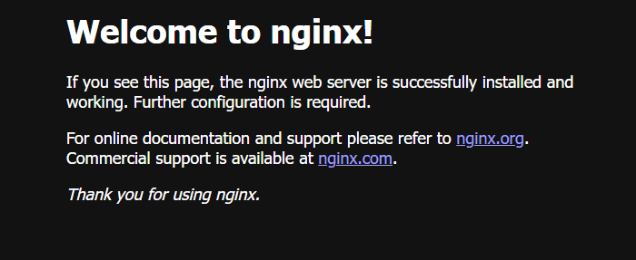
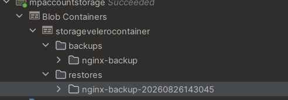

#  Velero on AKS with Azure Blob Storage 

Back up and restore Kubernetes resources with **Velero**, on a managed **AKS**
cluster, storing the backups in an **Azure Blob Storage** container.

The whole Azure side is described with **Terraform**, and Velero authenticates
through **Workload Identity (OIDC)**, so no access key is ever stored anywhere.

Full brief: [`docs/CONSIGNES.md`](docs/CONSIGNES.md).

## Architecture



## Requirements

- An Azure subscription, with `az` logged in
- [Terraform](https://developer.hashicorp.com/terraform/downloads) >= 1.7
- [kubectl](https://kubernetes.io/docs/tasks/tools/)
- [Velero CLI](https://github.com/vmware-tanzu/velero/releases)
- A GitLab personal access token with the `api` scope, for the remote state

## Design decisions

### Workload Identity rather than an access key

The brief tolerates storage access keys but prefers Workload Identity. Keys
were rejected here for three reasons: a key is a long lived secret that has to
live somewhere, rotating it means touching every consumer, and it grants access
to the whole storage account with no way to narrow it down.

With Workload Identity there is no secret at all. The cluster issues a signed
OIDC token, Azure validates it against the federated credential, and hands back
a short lived Azure token. The trust is declared once in Terraform:

```hcl
resource "azurerm_federated_identity_credential" "velero" {
  name                      = "velero-federated-credential"
  user_assigned_identity_id = azurerm_user_assigned_identity.velero.id
  audience                  = ["api://AzureADTokenExchange"]
  issuer                    = azurerm_kubernetes_cluster.velero.oidc_issuer_url
  subject                   = "system:serviceaccount:velero:velero"
}
```

The `subject` reads literally: the service account named `velero`, in the
namespace `velero`, of this cluster, may act as this identity. Nothing else can.

### Least privilege on the role assignment

The plugin documentation assigns `Storage Blob Data Contributor` at the
subscription scope. Here the scope is the storage account alone:

```hcl
resource "azurerm_role_assignment" "velero_storage" {
  scope                = azurerm_storage_account.velero.id
  role_definition_name = "Storage Blob Data Contributor"
  principal_id         = azurerm_user_assigned_identity.velero.principal_id
}
```

A visible consequence: the account that owns the storage account still cannot
read its contents, because Azure separates the management plane from the data
plane. Listing the blobs with `--auth-mode login` fails until a
`Storage Blob Data Reader` role is granted explicitly. That failure is the proof
that the scoping works.

### Remote state on GitLab

The Terraform state lives in the GitLab HTTP backend, not on disk. The backend
block stays empty and the configuration is injected from the environment by
[`scripts/tf-env.sh`](scripts/tf-env.sh), which prompts for the token and never
writes it anywhere:

```hcl
terraform {
  backend "http" {}
}
```

## Walkthrough

### 1. Infrastructure

```bash
make state-setup   # prompts for the GitLab token, then terraform init
make plan          # review, saved to tfplan.bin
make apply         # apply the reviewed plan
```

Terraform creates the AKS cluster, the storage account, the container, the
managed identity, the role assignment and the federated credential. It also
enables the two flags Workload Identity depends on:

```hcl
oidc_issuer_enabled       = true
workload_identity_enabled = true
```

Result:

```
$ kubectl get nodes
NAME                              STATUS   ROLES   AGE     VERSION
aks-default-21072884-vmss000000   Ready    <none>  3m40s   v1.35.7
```



### 2. The backup container

The container is created empty. Velero writes its own blobs into it, so nothing
is uploaded by hand: an empty container before the first backup is what makes
step 5 meaningful.



### 3. Velero

```bash
make kubeconfig
make setup-velero
```

[`scripts/velero-setup.sh`](scripts/velero-setup.sh) creates the annotated
service account, builds the configuration file in a temporary path, and runs
`velero install` with the Azure plugin. The file it writes holds no secret, only
the subscription id, the resource group and the cloud name.

Two details decide whether this works at all: the
`azure.workload.identity/client-id` annotation on the service account, and the
`--pod-labels azure.workload.identity/use=true` flag, which is what makes the
admission webhook inject the token into the Velero pod.

Result:

```
$ make check
NAME      PROVIDER   BUCKET/PREFIX            PHASE       ACCESS MODE   DEFAULT
default   azure      storagevelerocontainer   Available   ReadWrite     true
```

`Available` in `ReadWrite`, with no key anywhere in the chain.

### 4. Backup and restore

```bash
make app       # nginx Deployment + Service, namespace velero-lab
make backup    # back up the namespace
make drop      # delete it
make restore   # bring it back
```

Result:

```
$ make backup
Backup completed with status: Completed.

$ make drop
namespace "velero-lab" deleted

$ make restore
Restore completed with status: Completed.

NAME                    READY   UP-TO-DATE   AVAILABLE   AGE
deployment.apps/nginx   2/2     2            2           12s

NAME            TYPE           CLUSTER-IP     EXTERNAL-IP     PORT(S)        AGE
service/nginx   LoadBalancer   10.0.173.177   20.19.221.172   80:31657/TCP   12s
```

Both replicas came back, and the Service was reassigned a public IP. The
application answers `HTTP 200` again after the restore.



### 5. Blobs in the container

```bash
make blobs
```

```
backups/nginx-backup/nginx-backup.tar.gz
backups/nginx-backup/velero-backup.json
backups/nginx-backup/nginx-backup-resource-list.json.gz
backups/nginx-backup/nginx-backup-logs.gz
backups/nginx-backup/nginx-backup-results.gz
backups/nginx-backup/nginx-backup-itemoperations.json.gz
backups/nginx-backup/nginx-backup-podvolumebackups.json.gz
backups/nginx-backup/nginx-backup-volumeinfo.json.gz
backups/nginx-backup/nginx-backup-volumesnapshots.json.gz
restores/nginx-backup-20260826135112/...
```

Velero built the `backups/` and `restores/` layout itself.



If `make blobs` returns a permissions error, the account running it has no data
plane role yet. This is expected, see the least privilege section:

```bash
az role assignment create \
  --assignee <your-object-id> \
  --role "Storage Blob Data Reader" \
  --scope $(az storage account show -g mpetitRG -n mpaccountstorage --query id -o tsv)
```

## Makefile reference

```bash
make help          # list every target

make state-setup   # configure the GitLab remote state backend
make plan          # review infrastructure changes
make apply         # apply the reviewed plan
make destroy       # tear everything down

make kubeconfig    # point kubectl at the cluster
make setup-velero  # install Velero with Workload Identity
make app           # deploy nginx
make status        # nodes, application and Velero state

make check         # backup location must be Available
make backup        # back up the namespace
make drop          # delete it
make restore       # bring it back
make blobs         # list what Velero wrote to Azure
```

## Repository structure

```
.
├── Makefile                     # every command of the walkthrough
├── kubernetes/
│   ├── deployment.yaml          # namespace velero-lab + nginx Deployment
│   └── service.yaml             # nginx Service, type LoadBalancer
├── scripts/
│   ├── tf-env.sh                # GitLab remote state backend, sourced
│   └── velero-setup.sh          # Velero install with Workload Identity
├── terraform/
│   ├── main.tf                  # AKS, storage, identity, federated credential
│   ├── variables.tf
│   ├── outputs.tf
│   └── versions.tf
└── docs/
    ├── CONSIGNES.md             # project brief
    └── img/                     # screenshots
```

## Troubleshooting

**`Error: address argument is required` on `terraform init`**

The HTTP backend has no configuration. Run `make state-setup`, which sources
`scripts/tf-env.sh` and exports the `TF_HTTP_*` variables.

**`/bin/sh: Syntax error: word unexpected` on a shell script**

The script has CRLF line endings. `core.autocrlf=true` rewrites them on
checkout, and `/bin/sh` refuses to parse them. `.gitattributes` pins every text
file to LF; on an already cloned repository, run `git add --renormalize .`.

**Backup location stuck on `Unavailable`**

Check, in this order: the `azure.workload.identity/client-id` annotation on the
service account, the `azure.workload.identity/use=true` pod label, and the role
assignment, which can take a minute or two to propagate. Then read the logs:

```bash
kubectl logs -n velero deploy/velero
```

**`Managed identity "id-velero" not found`**

`make setup-velero` ran before `make apply`. The Azure side must exist before
the cluster side can reference it.

## Documentation

**Velero**

- [How Velero works](https://velero.io/docs/main/how-velero-works/)
- [Azure plugin setup](https://github.com/velero-io/velero-plugin-for-microsoft-azure#setup): the guide followed here
- [Backup reference](https://velero.io/docs/main/backup-reference/): `--include-namespaces` vs `--selector`
- [Restore reference](https://velero.io/docs/main/restore-reference/)
- [BackupStorageLocation](https://velero.io/docs/main/api-types/backupstoragelocation/): turns `Unavailable` when authentication fails

**Azure**

- [Workload Identity on AKS](https://learn.microsoft.com/azure/aks/workload-identity-overview)
- [Azure RBAC for blob data](https://learn.microsoft.com/azure/storage/blobs/authorize-access-azure-active-directory): management plane vs data plane
- [Managed identities](https://learn.microsoft.com/entra/identity/managed-identities-azure-resources/overview)

**Terraform**

- [azurerm_kubernetes_cluster](https://registry.terraform.io/providers/hashicorp/azurerm/latest/docs/resources/kubernetes_cluster)
- [azurerm_federated_identity_credential](https://registry.terraform.io/providers/hashicorp/azurerm/latest/docs/resources/federated_identity_credential): `user_assigned_identity_id` replaced `parent_id` in azurerm 5.0
- [GitLab HTTP backend](https://docs.gitlab.com/ee/user/infrastructure/iac/terraform_state.html)
